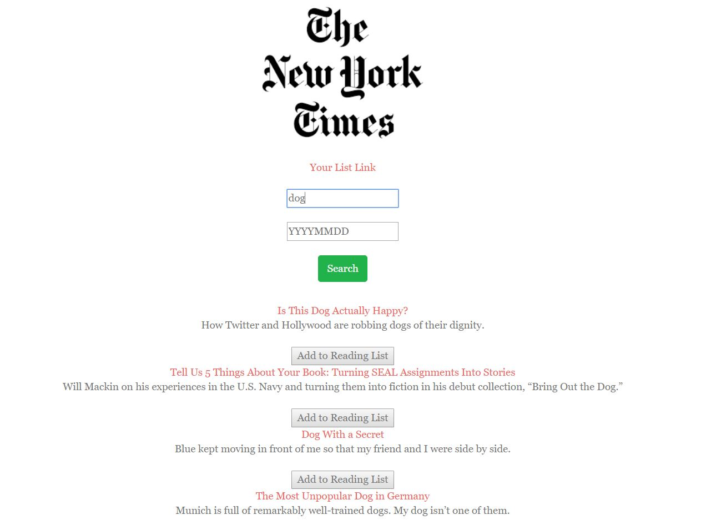
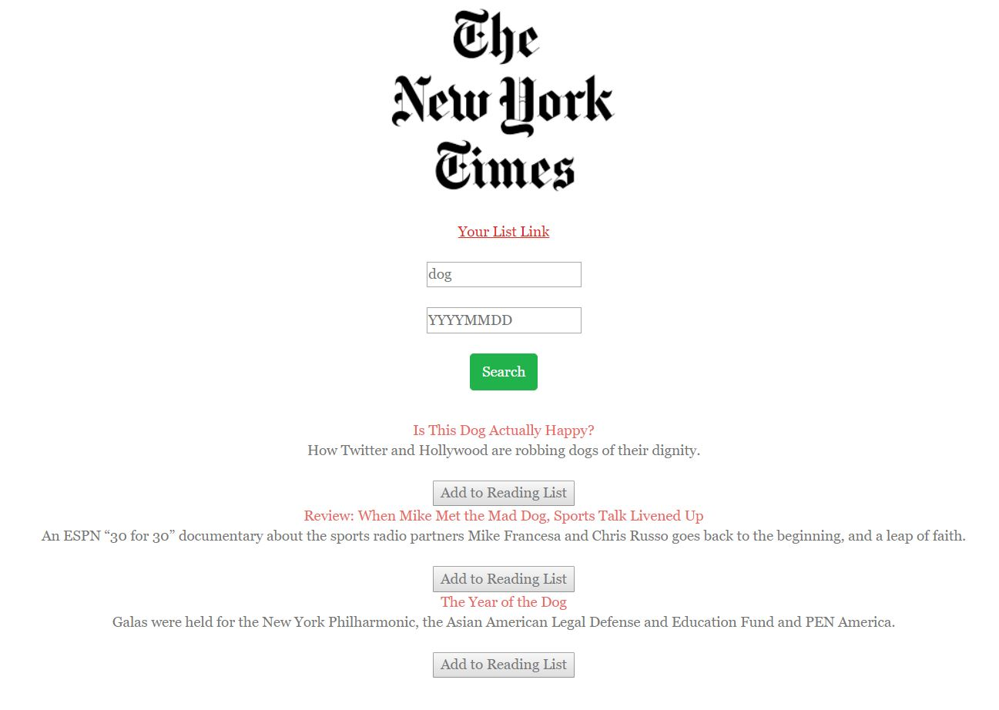

# ReactScraper
React-based rendition of the New York Times Article Search application. Create React components, helper/util functions, and utilize the React mounting lifecycle to query and display articles based on user searches. Also uses Node, Express and MongoDB so that users can save articles to read later.

##### Below is a sample screen search for dog

##### Below is a sample saved articles screen

